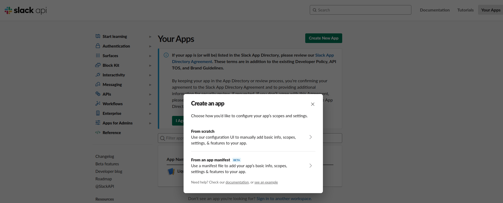
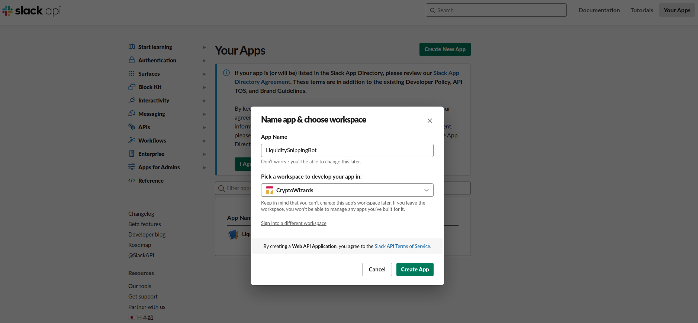
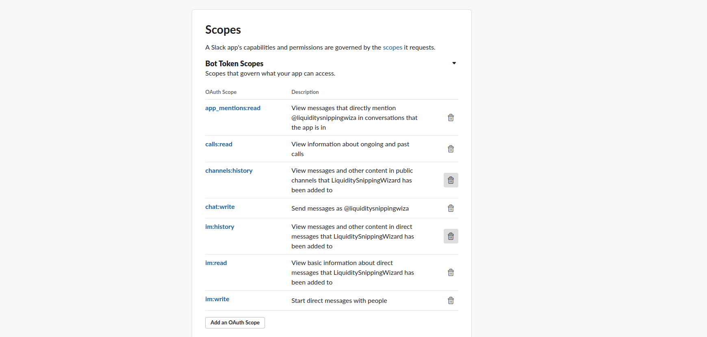
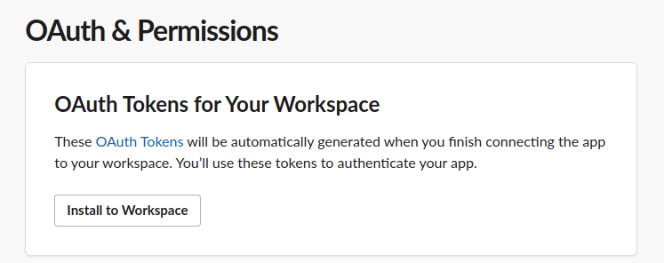
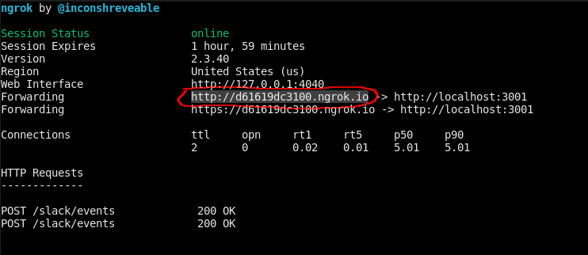
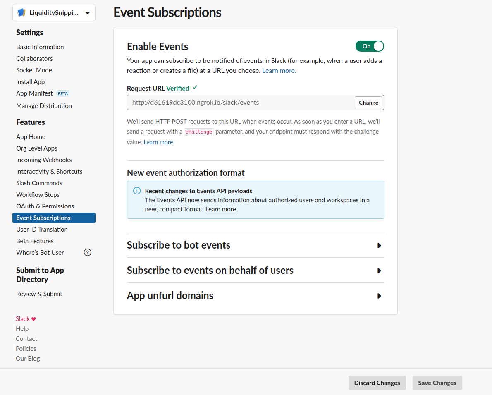
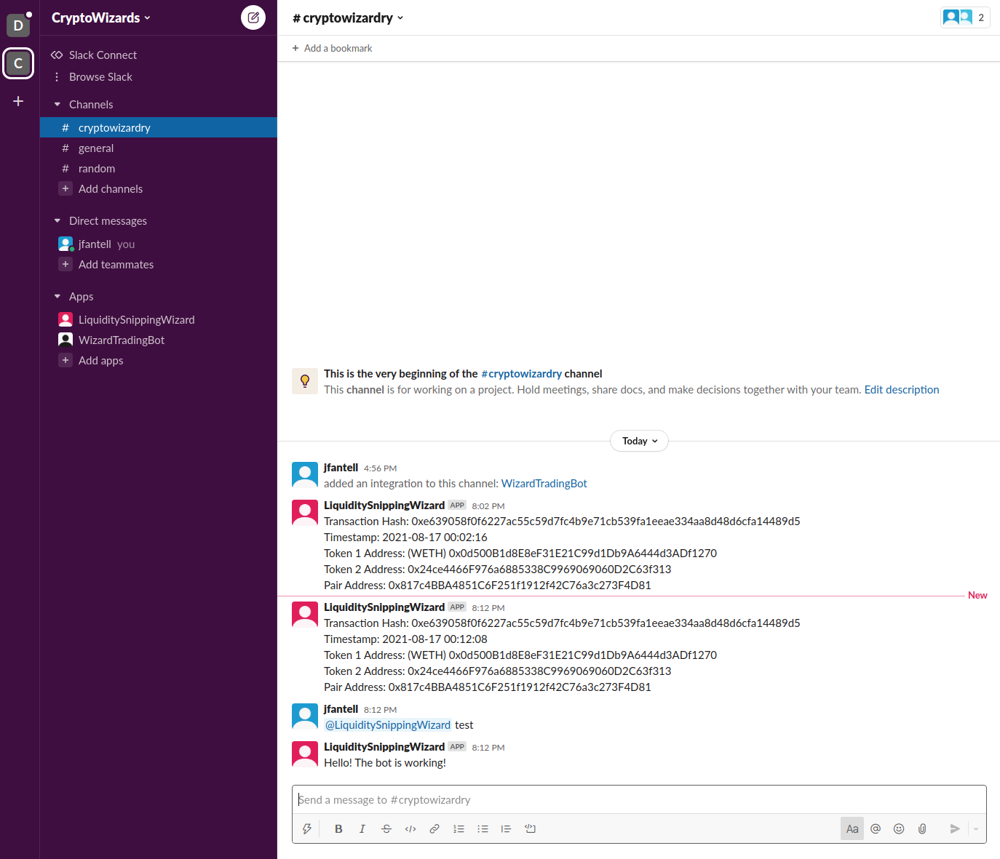

## Overview

When a new coin is added to a DEX (decentralized exchange) it typically increases rapidly in value.
The LiquditySnippingWizard is a slack bot that monitors QuickSwap (on the Matic network) for the creation of new markets/pairs.

## Prerequisites

### Software
1. Install node.js (Highly reccomend installing node via [nvm](https://github.com/nvm-sh/nvm))
2. Install [ngrok](https://ngrok.com/download)
    * This is needed for running a development server on your local machine.
3. Install [git](https://git-scm.com/)

### Slack

1. Slack account
2. Slack workspace where the bot will be installed

### Optional Software

1. Install [nodemon](https://www.npmjs.com/package/nodemon)
    * nodemon automatically restarts your node.js application when file changes in the application directory are detected. It is a handy development tool.

## Installation Instructions

Note: This project has only been tested on a machine running Ubuntu Linux 20.04

1. Go to [https://api.slack.com/](https://api.slack.com/) in a browser and click the "Create an app" button
2. When prompted choose to create an app "From scratch"

3. Enter a name and choose the workspace in which the app/bot will be installed

4. Navigate to the "OAuth and Permissions" page and add the scopes identified in the image below

5. Find the "OAuth Tokens for Your Workspace" section at the top of the page and click the `Install to workspace` button
    * Proceed through the confirmation prompts

6. Copy the newly generated "Bot User OAuth Token" to the `.env` file in your local repository
    * SLACK_BOT_TOKEN=<Bot User OAuth Token>
7. Navigate to the "Basic Information" page and under the "App Credentials" section find "Signing Secret" and copy it to the `.env` file in your local repository
    * SLACK_SIGNING_SECRET=<Signing Secret>
8. Open a terminal, navigate to your repository, and run `node liquidity_snipping/bot.js`
9. Open a new terminal and run `ngrok http 3001`
10. Copy the circled IP address to your clipboard

10. In the browser navigate to the `Event Subscriptions` page
11. Paste the IP address in the "Request URL" field and append "/slack/events" to it
    * Make sure to hit the "Save Changes" button at the bottom of the page

12. Now go to your slack workspace, type "@<Bot Name> test, and verify the response matches that in the image

## Possible Extensions

- [] Notify Slack users whether any of the new pairs are [incentivized](https://quickswap.exchange/#/quick)

## License

MIT